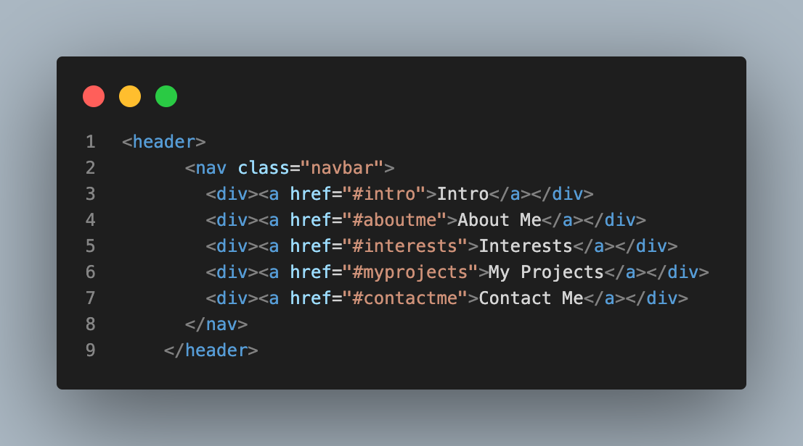
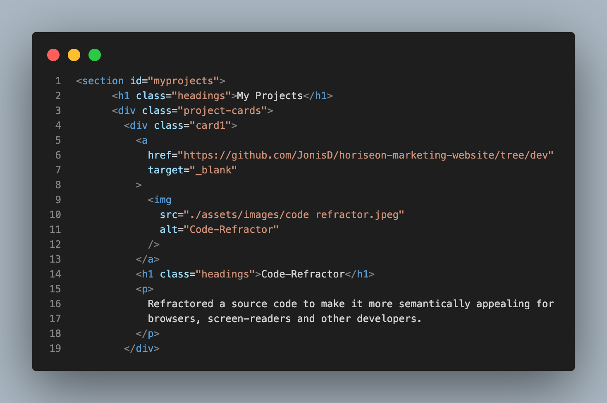
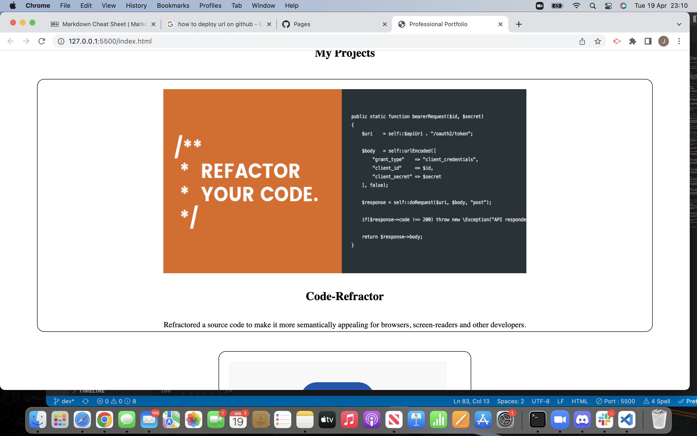
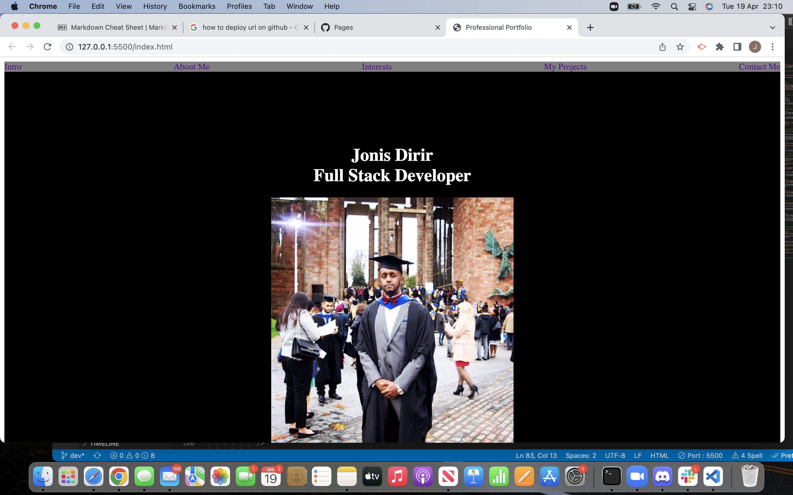
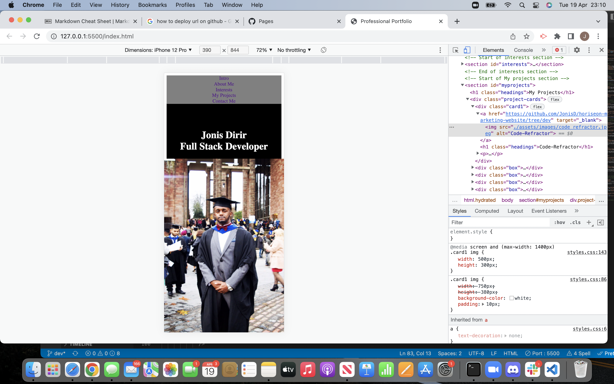
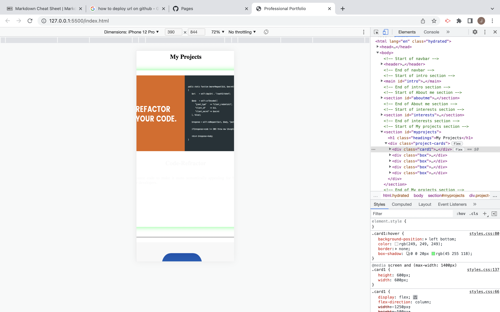

# Personal-Portfolio

# DESCRIPTION

To create a portfolio that is attractive to prospective employers showcasing the projects that I have worked on and completed.
Moreover, this portfolio also, features unique facts about myself such as my general hobbies and interests with text and also images throughout the portfolio. Furthermore, the framework of the web-page was designed to be mobile responsive throughout the entire portfolio.

# DEPLOYED URL

[GitHub Deployed link ](https://jonisd.github.io/personal-portfolio-/)

# TECHNOLOGIES USED

HTML and CSS were used to create this portfolio page.

# SCREENSHOTS OF SOME THE CODE USED

# DESKTOP VIEWPORTS

# MOBILE VIEWPORTS

